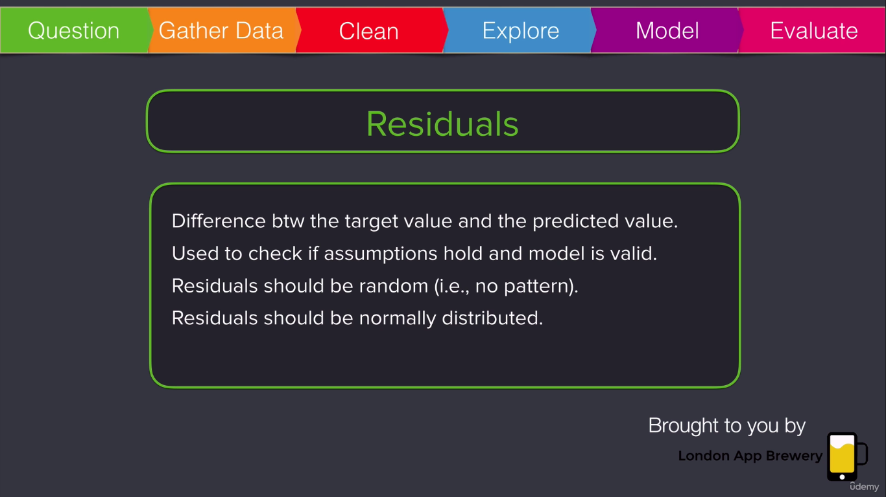

# Notas del curso de Ciencia de Datos

Los que se muestran en la siguiente figura son los pasos típicos que todo científico de datos hace en su proyecto de Inteligencia Artificacial.

Lo primero que debemos hacer es definir el problema y asegurarnos que que estamos haciendo las preguntas correctas.

Cuestiones a tener en cuenta acerca de los datos:
* Fuente de datos
* Descripción del conjunto de datos
* Cantidad de datos
* Número de aspectos (_features_) medidos (columnas del _dataframe_)
* Nombre de los aspectos (_features_)
* Descripción de cada aspecto

Features: Columnas del dataset. Estos son los atributos del conjunto de datos.
Instance: Filas del dataset.

:warning: No es lo mismo _atributo_ en Machine Learning que en programación. :warning:

:warning: No es lo mismo _instance_ en Machine Learning que en programación. En programación, una instancia es un objeto. :warning:

En la visualización de datos nos interesan dos cosas:
* Distribución. Normalmente se aprecia con histogramas.
* Valores atípicos (outliers)

## Problemas de Regresión

### ¿Cómo aprenden las computadoras?

Predice los coeficientes de la ecuación que definimos como hipótesis, luego estima el error de predicción. Tener en cuenta que si nuestra hipótesis es errónea el problema no es de la computadora.

Otros términos con los que se suele hacer referencia a la función de costo o Cost Function: Loss Function, Error Function, Objective Function.

En Machine Learning, la Función de Costo que se utiliza es el Error Medio Cuadrático (MSE - Mean Squared Error). Esta es una variante del residuo de la suma de los cuadrados, que provee una idea de la cantidad de muestras que mi hipótesis no es capaz de representar.

Las variables ficticias (dummy variables) captan información binaria en los datasets.

### Análisis de los residuos

Cualquier patrón no aleatorio en los residuos indica que tenemos algún problema con nuestro modelo.

Características de los resuduos :point_down:

Así es como NO me gustaría que se vean los residuos :point_down:

Posibles problemas/soluciones:
* Considerar transformación de datos para un mejor ajuste
* Se podría estar omitiendo algún _feature_ importante
* Podría haber alguna interacción entre _features_
* Los _features_ del modelo podrían no estar captando información que explique el fenómeno

Así es como deberían verse los residuos :point_down:

## Problemas de Clasificación

Un problema típico es el de clasificar un correo electrónico como Spam / No Spam.

Fuente de información para este problema de clasificación: [Apache Spam Assassin](https://spamassassin.apache.org/old/publiccorpus/)

NOTA:

[Corpus](https://en.wikipedia.org/wiki/Text_corpus): Conjunto de documentos.

La **probabilidad condicional** es un asunto clave en Machine Learning.

El [Teorema de Bayes](https://en.wikipedia.org/wiki/Bayes'_theorem) es otro asunto clave en Machine Learning.

El algoritmo de [Naive Bayes](https://en.wikipedia.org/wiki/Naive_Bayes_classifier) para clasificar e-mails como spam asume independencia estadístiuca de cada palabra.

